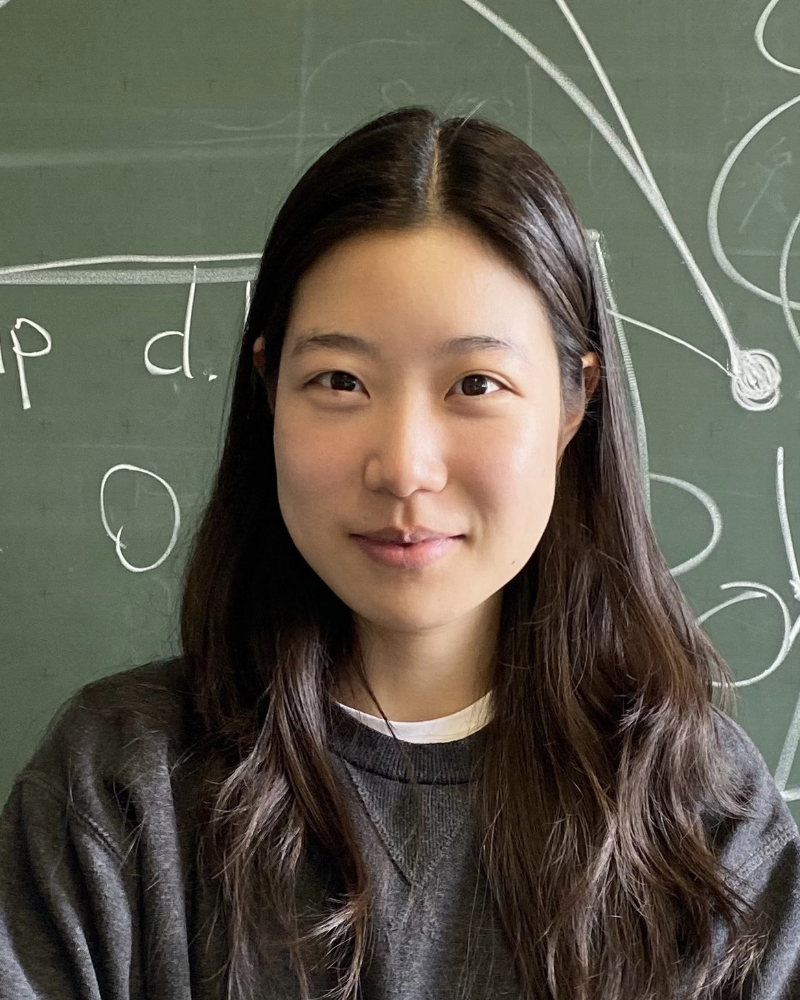

  

     
  

  

    

      <h3>Wonkyeong Lee</h3>

      Research Assistant 
      Hepatobiliary and Pancreatic Cancer Center 
      National Cancer Center Korea 

      email: uulee (at) stanford (dot) edu 

      [CV] | <a href="https://scholar.google.com/citations?hl=ko&user=RQUDWTsAAAAJ">[Google Scholar]</a> | <a href="www.linkedin.com/in/wonkyeong-lee">[LinkedIn]</a>
    

  

----

## Short Bio

I am an incoming PhD student in electrical engineering at Stanford University, and currently a research assistant at the National Cancer Center Korea.

Previously, I received my B.S. and M.S. degrees from Ewha Womans University, where I was advised by Prof. Jang-Hwan Choi. I was also a visiting student researcher at Stanford, advised by Prof. Adam Wang.

I am supported by a graduate study-abroad scholarship from the SBS Foundation and an EDGE Fellowship from Stanford University.

----

## Recent News

* 2025
  - **[May 01]** I will be joining Stanford University as a PhD student in Electrical Engineering starting this fall!

* 2024
  - **[May 01]** I have received the SBS Foundation Study Abroad Graduate Scholarship!
  - **[May 01]** One paper got accepted to Medical Image Analysis!
  - **[May 01]** I have received an EDGE Fellowship from Stanford University!
  - **[May 01]** I have been accepted to the PhD program in Electrical Engineering at Stanford!